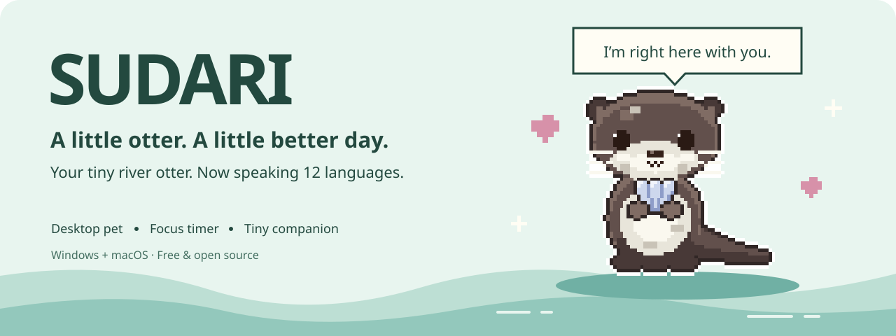
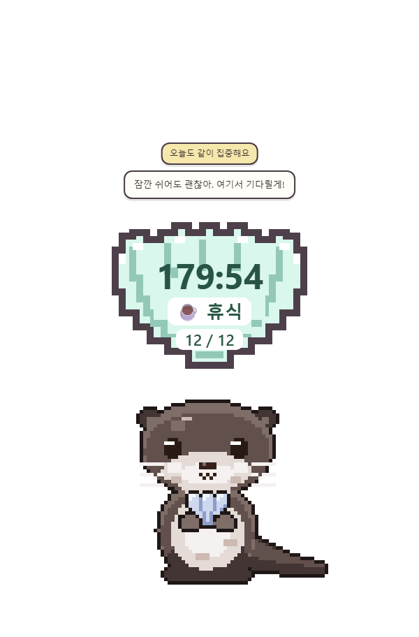
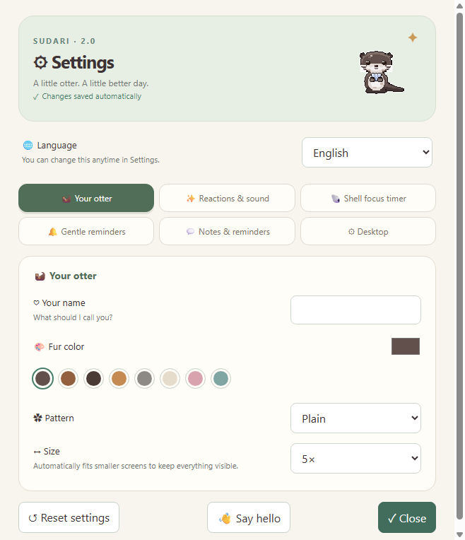
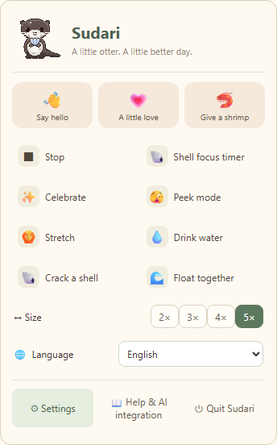

<p align="center"></p>

<p align="center"><b>일하는 당신 옆에, 작은 픽셀 수달 한 마리.</b><br>
타닥타닥 치면 꾹꾹이. 스크롤하면 조개 까기. 집중이 끝나면 함께 폴짝.<br>
가끔은 아무 이유 없이 사랑한다고 말해주는 데스크톱 친구예요.</p>

<p align="center"><b>한국어</b> · <a href="README.md">English</a> · <a href="https://github.com/seojaeohcode/SUDARI/releases/latest">다운로드</a> · <a href="CONTRIBUTING.md">함께 만들기</a></p>

<p align="center">
<a href="https://github.com/seojaeohcode/SUDARI/releases/latest"></a>
<a href="https://github.com/seojaeohcode/SUDARI/actions/workflows/release.yml"></a>


<a href="LICENSE"></a>
</p>

<p align="center"> &nbsp; </p>
<p align="center"><sub>가입도, 구독도 없어요. 조개 반 나눠줄 친구만 있으면 돼요. 🐚</sub></p>

## 🦦 수다리 입양하기

| 내 컴퓨터 | 바로 다운로드 · v2.0.1 |
| :--- | :--- |
| **Windows 10 / 11** · x64 | [설치형 EXE](https://github.com/seojaeohcode/SUDARI/releases/download/v2.0.1/Sudari-2.0.1-Setup.exe) · [무설치 EXE](https://github.com/seojaeohcode/SUDARI/releases/download/v2.0.1/Sudari-2.0.1-Portable.exe) |
| **Mac · Apple Silicon** (M 시리즈) | [DMG 다운로드](https://github.com/seojaeohcode/SUDARI/releases/download/v2.0.1/Sudari-2.0.1-mac-arm64.dmg) |
| **Mac · Intel** | [DMG 다운로드](https://github.com/seojaeohcode/SUDARI/releases/download/v2.0.1/Sudari-2.0.1-mac-x64.dmg) |

### 🧭 내 컴퓨터는 어떤 파일을 받으면 되나요?

**아래에서 내 컴퓨터에 맞는 파일 하나만 받으면 돼요.** 처음이라면 Windows는 **Setup.exe**, Mac은 칩 종류에 맞는 **.dmg**를 고르세요.

| 내 컴퓨터 / 사용 방식 | 릴리즈에서 고를 파일 | 이렇게 사용해요 |
| :--- | :--- | :--- |
| Windows 10·11, Intel 또는 AMD **x64** PC | **Sudari-2.0.1-Setup.exe** ⭐ 추천 | 실행하고 설치 안내를 따라가세요. |
| 같은 Windows PC에서 설치 없이 실행하고 싶어요 | **Sudari-2.0.1-Portable.exe** | 원하는 폴더에 저장한 뒤 실행하세요. 별도 설치 과정이 없어요. |
| **Apple M 시리즈** MacBook·iMac·Mac mini·Mac Studio 등 | **Sudari-2.0.1-mac-arm64.dmg** | 열어서 Sudari를 응용 프로그램 폴더로 끌어 놓으세요. |
| **Intel** 프로세서가 들어간 Mac | **Sudari-2.0.1-mac-x64.dmg** | 열어서 Sudari를 응용 프로그램 폴더로 끌어 놓으세요. |

**Mac 칩 확인:** 왼쪽 위 ** → 이 Mac에 관하여**를 여세요. **칩: Apple M…**이라고 나오면 `mac-arm64`, **프로세서: Intel…**이라고 나오면 `mac-x64`를 받으면 돼요. MacBook Air·Pro라는 제품 이름만으로는 구분할 수 없어요. [Apple 확인 안내](https://support.apple.com/en-au/116943)

**Windows 확인:** **설정 → 시스템 → 정보 → 장치 사양 → 시스템 종류**에서 **64비트 운영 체제, x64 기반 프로세서**인지 확인하세요. 현재 Windows 빌드는 x64용이며, Windows ARM/Snapdragon·32비트·Linux용 빌드는 제공하지 않아요. [Microsoft 확인 안내](https://support.microsoft.com/en-US/Windows/Experience/find-information-about-your-windows-device)

**나머지 파일은 뭐예요?**

- **mac-arm64.zip / mac-x64.zip:** 같은 Mac 앱의 압축 파일이에요. DMG 대신 사용할 때만 받고, 압축을 풀어 Sudari 앱을 응용 프로그램 폴더로 옮기세요. DMG와 ZIP을 둘 다 받을 필요는 없어요.
- **SHA256SUMS.txt:** 다운로드한 파일이 온전한지 확인할 때 쓰는 체크섬 목록이에요. 설치 파일이 아니에요.
- **Source code (zip) / Source code (tar.gz):** 개발용 소스 코드예요. 수다리를 설치해서 쓰려면 위의 EXE 또는 DMG를 받으세요.

Mac은 **macOS 12 이상**을 지원해요. ZIP과 파일 확인용 SHA-256은 [릴리즈 페이지](https://github.com/seojaeohcode/SUDARI/releases/latest)에 있어요. 실행할 때 Node.js나 Python은 필요 없어요.

**Windows:** 설치형 또는 무설치 파일을 실행해요. 코드 서명이 없는 개인 배포 앱이라 SmartScreen 안내가 뜰 수 있어요. 이 저장소에서 받은 파일인지 확인한 뒤 `추가 정보 → 실행`을 선택하세요.

**Mac:** DMG를 열고 Sudari를 **응용 프로그램** 폴더로 끌어 놓아요. Apple 공증을 받지 않아 첫 실행이 막히면, 출처를 확인한 뒤 `시스템 설정 → 개인정보 보호 및 보안 → 그래도 열기`를 선택하세요.

<details>
<summary>⌨️ Mac에서 키보드·스크롤 반응 켜기</summary>

메뉴바의 수다리 → **키보드·스크롤 반응 켜기**를 누르세요. 시스템 설정에서 **손쉬운 사용(접근성) / 입력 모니터링** 권한을 허용하고 수다리를 다시 켜면 돼요. 허용하지 않아도 시선 추적, 쓰다듬기, 타이머와 알림은 사용할 수 있어요.

</details>

바탕화면 오른쪽 아래에서 만나요. **수달 우클릭** 또는 **트레이 / 메뉴바 아이콘**으로 설정과 종료 메뉴를 열 수 있어요.

> 🫧 **2.0.1:** 메모·대사·조개가 가까이 모이고 겹치지 않아요. 집중·휴식 표시는 글자 길이에 맞춰 짧아졌어요. [수정 내용](docs/releases/2.0.1.md)

<p align="center"></p>

> 🐚 **2.0.0:** 새로 그린 수달과 조개, 선명한 집중·휴식 표시, 귀여운 우클릭 메뉴와 탭 설정창을 만나보세요. 조개가 수달 머리 가까이 붙고 함께 커져요. 작은 화면에서는 잘리지 않게 크기를 맞춰요. [변경 내용](docs/releases/2.0.0.md)

## 🌐 이제 12개 언어로 만나요

English · 한국어 · 日本語 · 简体中文 · 繁體中文 · Español · Français · Deutsch · Português (Brasil) · Italiano · Русский · العربية

설치 또는 첫 실행은 영어로 시작해요. 언어를 고르면 대사, 우클릭 목록, 조개 타이머, 설정창에 모두 적용되고 다음 실행에도 기억해요. **설정 → 언어**에서 언제든 바꿀 수 있어요. 직접 적은 메모와 메시지는 그대로 유지돼요.

<p align="center"> </p>

## 오늘은 같이 뭘 할까요?

| | 당신이 이렇게 하면 | 수다리는 이렇게 해요 |
| :---: | :--- | :--- |
| 👀 | 마우스를 움직여요 | 눈으로 졸졸 따라와요. 머리를 문지르면 `^^` 눈과 하트! |
| ⌨️ | 타닥타닥 일해요 | 작은 키보드에 꾹꾹이. 너무 빠르면 머리에서 김이 모락모락. |
| 🐚 | 스크롤을 내려요 | 앉아서 앞발로 조개를 톡톡. 다 까면 열린 조개를 보여줘요. |
| ⏳ | 집중을 시작해요 | 조개 타이머로 집중과 휴식. 마지막 회차까지 끝내면 폭죽 팡! |
| 💧 | 쉬는 걸 깜빡해요 | 물, 스트레칭, 밥 시간을 챙겨줘요. 시간과 주기는 직접 정해요. |
| 🤖 | AI 작업을 끝내요 | 로컬 훅으로 알려주면 같이 고민하고, 완료되면 폴짝 뛰어요. |
| 💕 | 그냥 곁에 있어요 | 인사하고, 새우 먹고, 헤엄하고, 졸다가 가끔 마음을 전해요. |

<p align="center"></p>

## 🎨 내 수달은 무슨 색일까

<p align="center"></p>

트레이 → **설정…**에서 원하는 친구로 꾸며요.

- **털 색 8종 + 직접 고른 색**, 민무늬·점박이·줄무늬·이마 무늬
- **2~5배 크기**, 대사에서 불러줄 이름, 머리 위 고정 메모
- 소리와 반응 켜기/끄기, 식사·물·스트레칭 알림, 로그인 시 자동 실행

이름을 적으면 **“사랑해 ○○!”**, **“○○, 밥 먹으러 가자!”** 하고 불러줘요.

| 조작 | 반응 |
| :--- | :--- |
| 몸통 드래그 | 모찌처럼 늘어나며 이동해요. 놓으면 톡, 착지! |
| 머리 쓰다듬기 | 웃는 눈과 하트, 고롱고롱 소리 |
| 꼬리 잡기 | “야! 꼬리 잡지 마!” 너무 놀리면 삐져요. |
| 머리 위 조개 클릭 | 집중·휴식·반복을 `−` / `+`로 정해요. |
| 빼꼼 모드 | 화면 가장자리에 살짝 숨어서 곁에 있어요. |
| 우클릭 / 트레이 메뉴 | 인사, 새우, 폭죽, 설정, 종료 |

## 🤖 AI에게도 응원 담당이 생겼어요

도구가 작업을 시작하고 끝낼 때 아래 주소로 신호를 보내면 돼요.

```bash
curl --max-time 1 http://127.0.0.1:37421/thinking
curl --max-time 1 http://127.0.0.1:37421/done
```

Windows PowerShell에서는 `curl.exe`를 사용하세요. Claude Code처럼 시작·종료 훅에서 명령을 실행할 수 있는 도구와 연결할 수 있어요. AI 연동 없이도 수다리의 모든 일반 기능을 쓸 수 있어요.

[Claude Code 설정 예시와 자세한 사용법 →](docs/guide.ko.md#-ai-에이전트-연동)

## 🔒 내 컴퓨터 안에서만 살아요

수다리는 입력 후크에서 **키 눌림 횟수와 스크롤 활동**만 사용해요. 네이티브 후크가 운영체제 입력 이벤트를 받지만, 앱은 입력한 글이나 키 코드를 기록하지 않아요. 분석·추적 데이터를 보내지 않으며, AI 연동 서버는 `127.0.0.1`에서만 요청을 받아요.

| 운영체제 | 설정 파일 |
| :--- | :--- |
| Windows | `%APPDATA%\sudari\config.json` |
| macOS | `~/Library/Application Support/sudari/config.json` |

## 🛠 수다리를 직접 키워보기

```bash
git clone https://github.com/seojaeohcode/SUDARI.git
cd SUDARI
npm ci
npm start
```

Node.js **22.12 이상**이 필요해요. 스프라이트를 다시 만들 때만 Python + Pillow가 필요해요.

| 하고 싶은 일 | 명령 |
| :--- | :--- |
| 레이아웃 회귀 검사 | `npm test` |
| 실제 Electron 실행·조개 클릭 검사 | `npm run test:smoke` |
| Windows에서 EXE 빌드 | `npm run dist` |
| Mac에서 Intel + Apple Silicon 빌드 | `npm run dist:mac` |
| 스프라이트 다시 생성 | `npm run sprites` |

`web/demo.html`을 열면 같은 엔진을 브라우저에서도 만져볼 수 있어요. 태그 배포는 Windows·Mac Intel·Mac Apple Silicon의 검사와 빌드가 **모두 성공한 뒤** 파일 6종과 체크섬을 함께 공개해요.

## 🌱 같이 키워요

수다리는 **코드도, 픽셀 수달도 [Apache-2.0](LICENSE) 오픈소스**예요. 스프라이트 생성기까지 들어 있어요.

[버그 알려주기](https://github.com/seojaeohcode/SUDARI/issues/new/choose) · [기여 안내](CONTRIBUTING.md) · [구조와 자세한 사용법](docs/guide.ko.md)

새 동작 아이디어, 번역, 작은 수정도 환영해요. 한국어와 영어 편한 쪽으로 이야기해 주세요.

<p align="center"><b>오늘 수다리 때문에 한 번 웃었다면, ⭐로 다른 친구에게도 소개해 주세요.</b><br><sub>작은 수달이 더 많은 책상에 놀러 갈 수 있어요.</sub></p>
