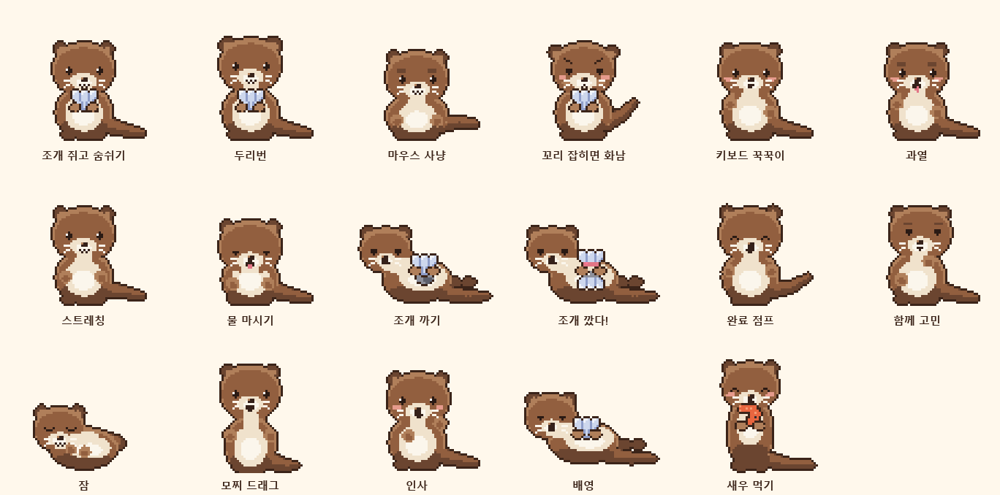
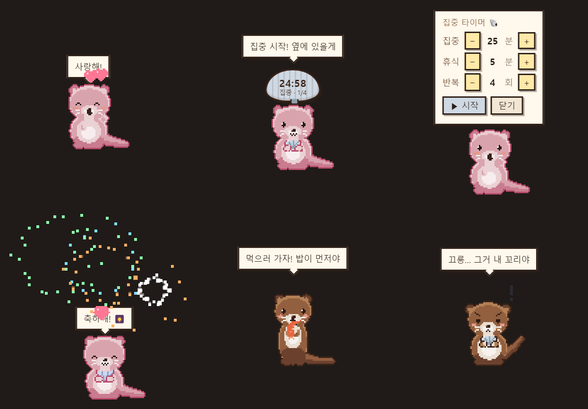

<p align="center">
  
</p>

<h1 align="center">SUDARI</h1>

<p align="center">
  <b>수다리 — 내 컴퓨터에 사는 픽셀 수달</b><br>
  마우스를 쫓아 눈을 굴리고, 타이핑하면 꾹꾹이를 하고, 스크롤하면 조개를 까고,<br>
  일이 끝나면 폴짝 뛰고, 가끔은 사랑한다고 말해주는 작은 데스크톱 친구예요.
</p>

<p align="center">
  <a href="https://github.com/seojaeohcode/SUDARI/releases/latest"></a>
  
  
  
</p>

<p align="center">
  
  &nbsp;&nbsp;
  
</p>

<br>

## 🐚 수다리는 이런 친구예요

바탕화면 오른쓸 아래에 앉아 **두 앞발로 조개를 꼭 쥐고** 당신을 지켜봐요.
따로 할 일은 없어요. 그냥 평소처럼 일하면 수달이 옆에서 반응하고, 챙기고, 가끔 혼자 놀아요.

- 마우스가 지나가면 **눈이 따라오고**, 머리를 문지르면 **^^ 눈이 되며 하트**가 떠요
- 타이핑하면 **꾹꾹이**, 스크롤하면 배영 자세로 **조개를 까요**
- 물 마실 시간·스트레칭 시간·**밥 먹을 시간**을 알려줘요
- **조개 모양 집중 타이머**로 집중하고, 다 끝나면 **폭죽**이 터져요
- 켜자마자 **"사랑해!"** 하고, 일하는 동안에도 가끔 마음을 전해요
- Claude Code 같은 **AI 에이전트가 생각하면 같이 고민하고, 끝나면 폴짝** 뛰어요

<br>

## ⬇️ 설치 — 30초

Node.js 같은 건 필요 없어요.

1. **[최신 릴리스](https://github.com/seojaeohcode/SUDARI/releases/latest)** 에서 파일을 받아요
   - `Sudari-x.y.z-Setup.exe` — 설치형 (바탕화면 아이콘 생김)
   - `Sudari-x.y.z-Portable.exe` — 설치 없이 바로 실행
2. 실행해요. Windows가 **"PC를 보호했습니다"** 창을 띄우면 `추가 정보 → 실행`
   (코드 서명이 없는 개인 배포 앱이라 뜨는 안내예요)
3. 오른쓴 아래에 수달이 나타나요. 🦦 트레이 아이콘이나 **수달을 우클릭**하면 메뉴가 열려요.

> 처음엔 이름이 비어 있어요. 설정에서 이름을 적으면 "사랑해 ○○!", "○○, 점심 먹으러 가자!" 하고 불러줘요.

<br>

## ✨ 이런 걸 해요

<p align="center"></p>

### 곁에서 반응해요

| | 이렇게 하면 | 수달은 |
|---|---|---|
| 👀 | 마우스를 움직이면 | 화면 어디에 있든 **눈으로 쫓아요**. 멀리 있으면 가끔 딴 데도 봐요 |
| 🐾 | 커서를 빠르게 흔들면 | 자세를 낮추고 엉덩이를 꿍실꿍실, **사냥 모드** |
| 🤍 | 머리를 문지르면 | 눈이 `^^` 이 되고 하트가 뜨고 고롱고롱 소리를 내요 |
| 🍡 | 잡아서 끌면 | **모찌처럼 늘어나요**. 흔들면 어지러워하고, 놓으면 떨어져 착지 |
| 😾 | 꼬리를 잡으면 | 눈썹을 치켜올리고 볼을 부풀리며 **"야! 꼬리 잡지 마!"** 세 번 연속이면 등 돌리고 삐져요 |

### 일할 때 옆에서

| | 이렇게 하면 | 수달은 |
|---|---|---|
| ⌨️ | 타이핑하면 | 키보드에 **꾹꾹이**를 해요 |
| 🔥 | 미친 속도로 치면 | 빨갛게 달아올라 머리에서 김이 나요 (초당 8타 이상일 때만) |
| 🐚 | 스크롤하면 | 배영 자세로 배 위에 돌을 얹고 **조개를 내려쳐요**. 다 까면 열린 조개! |
| 🤔 | AI 에이전트가 생각하면 | 고개를 갸웃하며 같이 고민해요 `?` |
| 🎉 | AI 작업이 끝나면 | 반짝이와 함께 **폴짝** 뛰고 찍찍 소리로 알려줘요 |

### 챙겨줘요

| | 언제 | 수달은 |
|---|---|---|
| 🧘 | 정한 주기마다 (기본 50분) | 몸을 쭈욱 늘리며 **"같이 스트레칭 하자!"** |
| 💧 | 정한 주기마다 (기본 60분) | 물을 마시며 **"물 마실 시간이야!"** (수달은 물이 좋아요) |
| 🍤 | 아침·점심·저녁 시간에 | 벌떡 서서 새우를 들고 **"밥 먹으러 가자! 밥이 먼저야"** |
| ⏰ | 정한 시각에 | 손을 흔들며 적어둔 메시지를 전해요 |
| 📌 | 항상 | 머리 위에 **고정 메모**를 띄워둘 수 있어요 |
| 🐚⏱ | 집중하고 싶을 때 | **조개 모양 타이머**가 머리 위에 떠요. 조개를 클릭하면 집중/휴식/반복을 `−`/`+`로 바로 정해요. 휴식 시간엔 배영, **다 끝나면 폭죽 🎆** |

### 마음을 전해요

| | | |
|---|---|---|
| 💕 | 켜자마자 | 손 흔들며 **"사랑해!"** |
| 💌 | 가끔 (기본 40분 전후) | 하트를 띄우며 "오늘도 옆에 있을게", "잘하고 있어", "조개 반 줄까?" |
| 🎈 | 심심하면 | 알아서 조개를 까고, 배영을 하고, 기지개를 켜고, 새우를 꺼내 먹어요 |
| 💤 | 오래 안 만지면 | 몸을 동그랗게 말고 잠들어요 `zzZ` — 만지면 두리번거리며 깨요 |
| 🫣 | 빼꼼 모드 | 영상 볼 때는 화면 끝에 매달려 반쯤만 보이고, 알림 외엔 방해하지 않아요 |

<p align="center"></p>

<br>

## 🎨 내 수달로 만들기

<p align="center"></p>

트레이 → **설정…** 에서

- **털 색** — 프리셋 8종, 또는 원하는 색 하나. 색 하나만 고르면 명암 6단계가 자동으로 만들어져요
- **무늬** — 민무늬 / 점박이 / 줄무늬 / 이마 무늬
- **크기** — 2배 ~ 5배
- **이름** — 대사에서 불러줘요
- 반응 켜기/끄기, 알림 주기, 식사 시간, 애정 표현 주기, 혼자 놀기, 로그인 시 자동 실행

설정은 `%APPDATA%\sudari\config.json` 에 저장돼요.

<br>

## 🖱 조작법

| 하는 법 | 뭐가 되나 |
|---|---|
| 수달 **우클릭** / 트레이 🦦 | 메뉴: 인사 · 사랑한다고 해줘 · 새우 주기 · 조개 까기 · 폭죽 · 스트레칭 · 물 · 배영 · 집중 타이머 · 빼꼼 모드 · 크기 · 설정 |
| 몸통 **드래그** | 옮기기 (모찌처럼 늘어남) |
| **꼬리** 클릭 | 화냄 |
| 머리 위 **조개 타이머** 클릭 | 시간 설정 패널 |
| 트레이 **더블클릭** | 인사 |

<br>

## 🤖 AI 에이전트 연동

수다리는 `127.0.0.1:37421` 에만 열리는 아주 작은 로컬 창구를 갖고 있어요.
작업 시작·끝에 요청 한 번씩만 보내면 같이 고민하고, 끝나면 폴짝 뛰어요.

```
http://127.0.0.1:37421/thinking          → 함께 고민
http://127.0.0.1:37421/done              → 완료 점프
http://127.0.0.1:37421/done?text=배포끝   → 말풍선 문구까지
```

**Claude Code** 라면 `.claude/settings.json` 에 훅 두 개:

```json
{
  "hooks": {
    "UserPromptSubmit": [
      { "hooks": [ { "type": "command", "command": "curl -s -m 1 http://127.0.0.1:37421/thinking" } ] }
    ],
    "Stop": [
      { "hooks": [ { "type": "command", "command": "curl -s -m 1 http://127.0.0.1:37421/done" } ] }
    ]
  }
}
```

Codex, Cursor 등 "작업 시작/종료에 명령 한 줄"을 걸 수 있는 도구라면 똑같이 동작해요.

<br>

## 🔒 프라이버시

- 전역 키보드 후크는 **"키가 눌렸다"만** 봐요. 어떤 키인지는 읽지도, 내보내지도 않아요 ([tools/input_hook.ps1](tools/input_hook.ps1))
- 네트워크는 `127.0.0.1` 로만 열려요. 외부 통신·추적·텔레메트리 없음
- 설정은 내 PC의 파일 하나에만 저장돼요

<br>

## 🛠 직접 빌드하기

Node.js 22+ 가 필요해요. 스프라이트를 다시 굽고 싶을 때만 Python 3 + Pillow.

```bash
git clone https://github.com/seojaeohcode/SUDARI.git
cd SUDARI
npm install
npm start          # 바로 실행
npm run dist       # dist/ 에 Setup.exe · Portable.exe
npm run sprites    # 스프라이트 다시 굽기 (python tools/gen_sprites.py)
```

배포는 태그만 밀면 GitHub Actions가 exe를 빌드해 Release에 올려요.

```bash
git tag v1.0.1 && git push --tags
```

`web/demo.html` 을 열면 브라우저에서도 같은 엔진으로 미리 볼 수 있어요.

<br>

## 🧩 어떻게 만들었나

수달은 그림 파일을 하나하나 그린 게 아니라 **[tools/gen_sprites.py](tools/gen_sprites.py) 가 파라미터로 굽는** 스프라이트예요.
머리 크기·주둥이 위치·앞발 높이·꼬리 곡선 같은 값을 포즈마다 바꿔 17개 애니메이션 73프레임(72×64)을 만들어요.

'귀여운 캐릭터' 규칙을 그대로 따랐어요 — 머리는 크고 둥글게, 눈은 얼굴 중간 아래에 멀리, 큰 눈동자에 하이라이트,
코는 작고 뭉툭, 입은 작고 끝이 올라간 ω, 순검정 대신 채도 있는 어두운 갈색 외곽선, 디더링 없이 재질당 3톤.

- **눈은 굽지 않아요.** 프레임마다 눈 좌표만 내보내고 런타임에 그려요 → 시선 추적·깜빡임·`^^` 눈이 프레임 폭발 없이 가능
- **색은 팔레트 치환**으로 바꿔요. 크림색 부위는 밝기를 고정해 어떤 털색이든 얼굴이 읽혀요
- 손에 든 **가리비**는 13×11 비트맵을 손으로 찍었어요. 위쪽 세 결, 경첩으로 모이는 골, 왼쪽 위 하이라이트
- 소리는 오디오 파일 없이 **WebAudio 합성** — 수달다운 찍찍 소리, 고롱고롱, 조개 "딱", 폭죽 "펑"

```
main.js                 Electron 메인 — 투명·항상 위 창, 커서 폴링, 트레이, 로컬 엔드포인트
preload.js              contextBridge (nodeIntegration 없음)
renderer/pet.js         행동 엔진 — 상태 머신, 반응, 타이머, 애정 표현, 혼자 놀기, 폭죽
renderer/sprite.js      시트 로더 · 팔레트 리컬러 · 런타임 눈 · 정수 배율 전사
renderer/audio.js       WebAudio 합성 사운드
renderer/settings.*     설정 창 (실시간 미리보기)
tools/gen_sprites.py    ★ 스프라이트 제너레이터
tools/input_hook.ps1    전역 키/휠 후크 (키 내용은 읽지 않음)
tools/make_docs.py      이 README 의 이미지들
assets/                 생성된 시트·아틀라스 (커밋됨 — 실행에 Python 불필요)
```

<br>

## 📄 라이선스

[Apache-2.0](LICENSE). 스프라이트와 코드 모두 이 저장소에서 만든 오리지널이에요.

<p align="center"><sub>콤냥이(comnyang.com)의 픽셀 고양이에서 영감을 받아, 수달 버전으로 처음부터 만들었어요.</sub></p>
